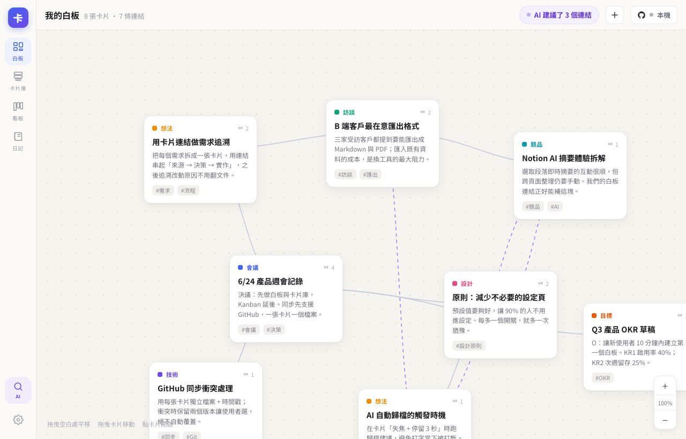

# 卡片盒筆記系統（Card-Note）

一個 Zettelkasten 風格的**純前端**卡片盒筆記系統。資料以「一張卡片一個 Markdown 檔」存進你自己的 GitHub 儲存庫，透過 GitHub 做多裝置同步；介面同時支援桌機與手機。

從設計稿（Claude Design）實作，包含四個主視圖：**白板 / 卡片庫 / 看板 / 日記**，加上卡片詳情（雙向連結）、AI 連結建議、AI 搜尋，與 GitHub 同步。

**🌐 線上版：<https://gpwork4u.github.io/card-note/>**（push main 自動部署；資料存在你自己連的 repo，站點本身不存任何人的筆記）



## 功能

- **白板**：可建立**多個白板**，每個白板放入你自己挑選的卡片子集（同一張卡可出現在多個白板、各有位置）。無限畫布，拖曳卡片、平移、縮放（滑鼠滾輪 / 雙指捏合）；卡片間以貝茲曲線連線（實線＝已確認、紫色虛線＝AI 建議）。可在白板上新建卡片或從卡片庫加入既有卡片。
- **卡片庫**：grid 檢視、即時搜尋（標題／內文／標籤）、標籤過濾。
- **看板**：多專案，待辦／進行中／已完成三欄，桌機拖放、手機分段切換。
- **日記**：每日隨手記，一鍵「AI 整理成卡片」抽取成多張卡片。
- **卡片詳情**：直接編輯標題／內文／型別／標籤；顯示雙向連結與 AI 建議連結（可接受／略過）。
- **GitHub 同步**：一卡一檔、每次變更一個 commit、完整歷史；編輯後自動推送（debounce 5 秒）；衝突時「保留兩版」，**絕不自動覆蓋**。
- **Heptabase 匯入**：支援 `All-Data.json`（含白板座標與連線）與 Markdown 匯出 zip。
- **離線可用**：資料快取在瀏覽器 IndexedDB，重整不掉、無網路也能編輯，連線後再同步。
- **響應式**：桌機左側導覽列 + 右側詳情面板；手機底部分頁列 + 全螢幕 bottom sheet。

## 技術棧

- React 18 + TypeScript + Vite（純靜態站）
- Zustand（狀態管理）
- IndexedDB（`idb`）本機快取
- GitHub REST API（Git Data / Contents）直接從瀏覽器同步——**不需要任何後端、不需要 CORS proxy**
- `js-yaml`（frontmatter）、`fflate`（解壓 Heptabase zip）

## 開始使用

```bash
npm install
npm run dev        # 開發伺服器
npm run build      # 產生 dist/（靜態檔）
npm run preview    # 預覽 build 結果
npm run typecheck  # 型別檢查
```

首次開啟會載入一份種子資料，可立即把玩四個視圖。

## 設定 GitHub 同步（建立你的資料 repo）

App 本身不存任何資料——筆記存在**你自己的 GitHub 儲存庫**（資料 repo）。第一次使用照以下步驟建立：

1. **建立資料 repo**：到 <https://github.com/new> 建一個**空的儲存庫**（例如 `me/notes`），建議設 **Private**。不要勾任何初始化選項也可以；就算勾了 README 也沒關係——app 只管理它自己的檔案（`cards/`、`boards/`、`projects/`、`diary/`、`links.ndjson`、`cardnote.json`），repo 裡其他檔案（README、LICENSE、assets…）**絕不會被改動或刪除**。
2. **建立 fine-grained Personal Access Token**：到 <https://github.com/settings/personal-access-tokens/new>：
   - Repository access：**Only select repositories** → 只選這一個資料 repo
   - Permissions → Repository permissions → **Contents: Read and write**（其餘全部不需要）
   - 設定到期日（到期後在設定頁換新 token 即可，資料不受影響）
3. **在 App 連線**：右上角「同步」按鈕 → 進入設定，填入帳號（owner）、儲存庫名稱、分支（預設 `main`）、Token，按「連線並同步」。app 會先驗證權限，再把本機資料推上去（或把遠端資料拉下來合併）。

之後每台裝置（含手機瀏覽器）連到同一個 repo 就會同步；**編輯後約 5 秒自動推送**，不需要手動按同步（衝突時仍會跳出解決視窗）。你也可以在電腦上用一般 `git clone` 取得實體 Markdown 檔，用其他編輯器查看／編輯。

### 資料如何存放

```
<your-repo>/
├── cardnote.json          # schema 版本資訊
├── cards/<id>.md          # 一張卡片一個檔（YAML frontmatter + Markdown 內文，只含內容）
├── boards/<id>.json       # 一個白板一個檔（名稱 + 卡片擺放位置 placements）
├── links.ndjson           # 已確認連結，每行一條（利於乾淨 diff 與合併）
├── projects/<id>.json     # 一個專案一個檔
└── diary/<YYYY-MM-DD>.md  # 一天一個檔
```

卡片只存內容，位置存在白板的 placement 裡（一張卡可放在多個白板、各自有座標）。卡片檔範例：

```markdown
---
id: 01J9Z3K7QX8M2V4R6T0YB9C1DE
type: idea
title: 用卡片連結做需求追溯
tags: [需求, 流程]
created: 2026-06-20T09:00:00Z
updated: 2026-06-27T09:00:00Z
---
把每個需求拆成一張卡片，用連結串起「來源 → 決策 → 實作」。
```

白板檔範例（`boards/b1.json`）：

```json
{
  "id": "b1",
  "name": "產品白板",
  "placements": [
    { "cardId": "01J9Z3K7QX8M2V4R6T0YB9C1DE", "x": 140, "y": 120 }
  ]
}
```

### 衝突處理

採三方比對（以本機快取的上次同步內容為 merge-base）。只有單側修改會自動套用；兩側都改了同一張卡時會跳出衝突視窗，預設「兩個都留」——把雲端版另存成一張新卡（標題加「(衝突複本)」），保證零資料遺失，再由你手動合併。連結檔以行為單位合併，不會復活已刪除的連結。

## 從 Heptabase 匯入

在 Heptabase：Settings → Backup & Sync → Export，匯出 **All-Data.json**（推薦，含白板座標與連線）或整包 zip。
在 App：設定 → 從 Heptabase 匯入 → 選檔 → 確認後加入卡片庫。匯入會顯示報告（匯入數、略過的連線、轉換為純文字的複雜內容等）。

## AI 功能

目前 AI（搜尋、連結建議、日記抽卡、自動分類）使用**本機關鍵字／標籤比對**，離線可用、零成本。
程式以 `src/ai/provider.ts` 介面層設計，之後可在 `src/ai/claude.ts` 接上 **Claude API**（瀏覽器直連、使用者自備 Anthropic API key、`dangerouslyAllowBrowser`、模型 `claude-sonnet-4-6` / `claude-haiku-4-5`），即為 drop-in 替換，UI 不需更動。設定頁已預留 API key 欄位。

## 語音草稿收件匣（iPhone，可選）

用一個 iPhone 捷徑對著手機說話，轉錄結果直接推成資料 repo 裡 `inbox/` 的一則草稿，之後交給 AI agent 打標籤、整理，值得留的再升級成正式卡片。純捷徑實作，不需要自架任何服務。

完整設定步驟（token 權限、捷徑動作、agent prompt）見 **[docs/VOICE-INBOX.md](docs/VOICE-INBOX.md)**。

> ⚠️ `inbox/` 刻意**不在** app 的管理範圍內，app 從不讀寫它。別把 `inbox/` 加進 `OWNED_PREFIXES`——同步會把「app 擁有但本機沒有」的檔案刪掉，草稿會被靜默清空。

## 用 AI 自動整理筆記（可選）

資料 repo 就是一般的 git 檔案（Markdown + JSON），所以任何能讀寫 git 的 AI agent 都可以定時當「整理助手」：產生摘要報告、建議卡片連結、把日記抽成卡片。以下兩種做法擇一即可。

**共同的安全守則**（不管用哪種 agent，prompt 裡都建議寫明）：

- **報告類產出**（如 `reports/digest-<日期>.md`）可以直接 commit 到 main——`reports/` 不在 app 的管理範圍（app 只管 `cards/` `boards/` `projects/` `diary/` `links.ndjson` `cardnote.json`），不會被同步或誤刪。
- **會動到筆記本體的變更**（新增連結、改卡片、日記抽卡）一律**開 PR**，由你人工核實後合併——AI 建議的連結品質需要人把關。
- push 前先 `git pull --rebase`——app 端的自動同步隨時可能推新 commit。

### 方法一：Claude Code routine（雲端排程，免自備機器）

在 Claude Code 裡輸入 `/schedule`（或到 <https://claude.ai/code> 的 Routines 管理頁）建立一個排程 agent，設定 repo 為你的資料 repo、排程如「每 6 小時」，prompt 範例：

```
你是卡片盒筆記的整理助手。讀取這個 repo 的 cards/、links.ndjson、diary/：
1. 產生一份整理報告 reports/digest-<今日日期>.md：新卡摘要、標籤分佈變化、
   孤島卡片（沒有任何連結的卡）清單。直接 commit 到 main。
2. 找出 3-8 組「內容高度相關但尚未連結」的卡片配對，附上理由，
   以修改 links.ndjson 的方式開一個 PR（不要直接推 main）。
3. 若 diary/ 有 processed: false 的日記，將可獨立成卡的段落抽成 cards/ 新卡，
   同樣開 PR。
不要動 cards/ 既有內容、boards/、projects/ 與 repo 內其他檔案。
```

這條路已實際運轉驗證過：routine 每 6 小時產出 digest 報告、連結建議走 PR 人工核實後合併。

### 方法二：codex CLI + 本機排程（資料不離開自己的機器）

用 [OpenAI codex CLI](https://github.com/openai/codex)（或 `claude` CLI 的 headless 模式 `claude -p`）配 cron，在本機 clone 上跑同樣的整理 prompt：

```bash
# crontab -e（每 6 小時）
0 */6 * * * cd ~/notes-data && git pull --rebase && \
  codex exec --full-auto "讀取本 repo 的卡片與日記，產生 reports/digest-$(date +\%F).md 整理報告；\
  發現值得建立的卡片連結時，開分支修改 links.ndjson 並用 gh pr create 開 PR，不要直接推 main。" && \
  git push
```

`claude` CLI 版本把 `codex exec --full-auto "…"` 換成 `claude -p "…" --allowedTools "Bash,Read,Write,Edit"` 即可。本機排程的好處是筆記內容不需要授權給雲端 agent 執行環境；代價是機器要開著才會跑。

兩種做法產出的 commit / PR，app 端都會透過自動同步的三方合併自然拉進來（`reports/` 除外，app 會忽略）。

## 部署

純靜態站，`npm run build` 後把 `dist/` 丟到任何靜態主機：

- **GitHub Pages**：`base` 已設為 `./`，可直接放 project page。
- **Vercel / Netlify**：framework 選 Vite 即可。
- 本機：`npm run preview`。

> 注意：放筆記的 GitHub repo 與部署 App 的位置是兩件事——App 是靜態網站，資料在你自己的 notes repo。

## 安全性

- Personal Access Token 只存在這台裝置的瀏覽器 IndexedDB，**不會被提交到 git**。
- 建議使用 fine-grained token、只授權單一 repo 的 Contents 讀寫，並設到期日。
- 由於是純前端，所有請求直接從你的瀏覽器送往 `api.github.com`（GitHub REST API 支援 CORS），中間沒有任何第三方伺服器。

## 已知限制

- 圖片／二進位附件 v1 先以 Markdown 連結／外部 URL 處理，尚未內嵌。
- Heptabase 的表格／數學／嵌入等複雜節點匯入時會降級為純文字（報告會標示）。
- GitHub API rate limit（fine-grained PAT 約 5000 req/hr）對個人用量充足；同步以批次 commit 降低請求數。

## 專案結構

```
src/
├── types/            型別定義
├── lib/              tokens（色票/型別表）、ulid、bezier、gitBlobSha、text、format、base64
├── store/            Zustand store + IndexedDB 持久化（persist）
├── serialization/    Card/Link/Project/Diary ↔ Markdown/NDJSON（git 檔案格式的唯一邊界）
├── sync/             githubApi、syncEngine（狀態機）、conflict（三方合併/保留兩版）、localCache
├── ai/               provider 介面、local（現用）、claude（預留）
├── importers/heptabase/  All-Data.json / Markdown zip 解析與映射
├── views/            WhiteboardView / LibraryView / KanbanView / DiaryView
└── components/       layout（AppShell/Rail/TopBar/BottomTabBar/DetailHost）、panels、common
```
